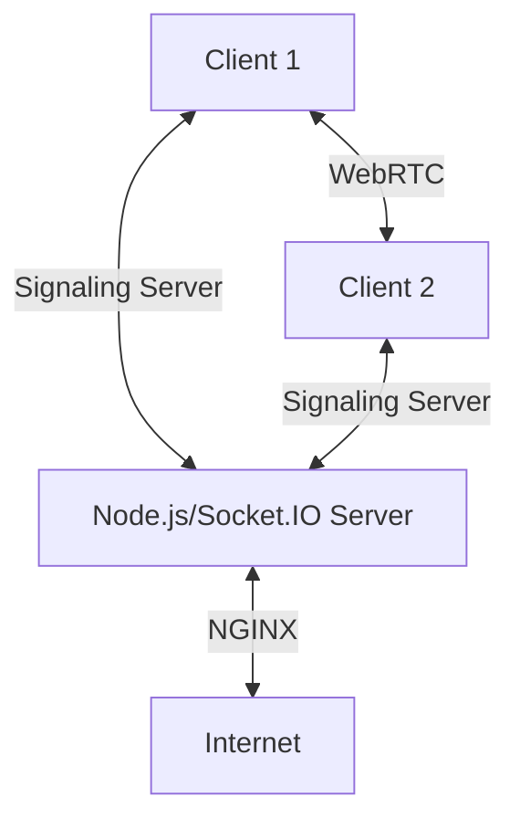
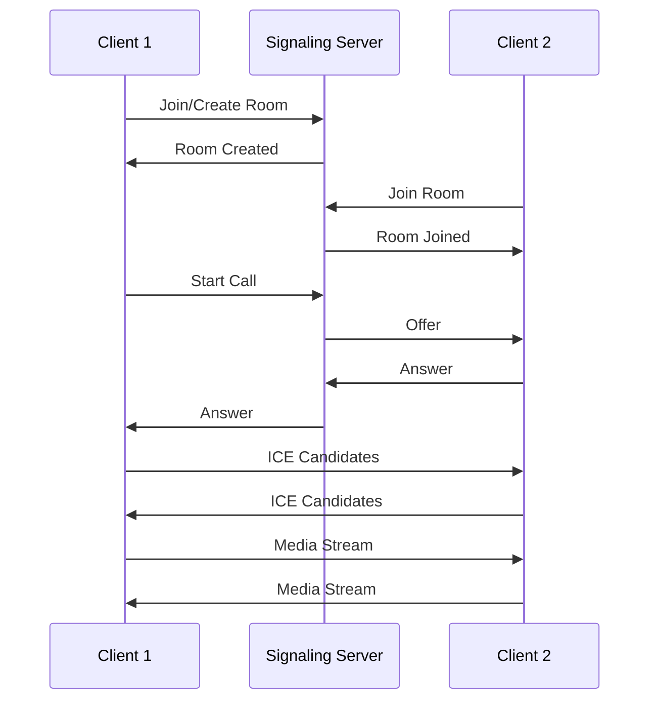

# WebRTC Video Chat Application

A real-time, peer-to-peer video chat application built with Node.js, Socket.IO, and WebRTC. This application allows users to create or join video chat rooms with end-to-end encryption for secure communication.

## 🌟 Features

- 🎥 Real-time video and audio streaming
- 🔒 Secure peer-to-peer connections using WebRTC
- 🏠 Create or join chat rooms
- 📱 Responsive design for desktop and mobile
- 🔄 Automatic reconnection handling
- 📊 Health check endpoint for monitoring
- 🐳 Docker and Docker Compose support
- 🔐 Self-signed SSL certificate generation

## 🏗️ Architecture



### Components

1. **Frontend**: HTML5, Vanilla JavaScript, WebRTC API
2. **Signaling Server**: Node.js with Socket.IO
3. **Reverse Proxy**: NGINX with SSL termination
4. **STUN Servers**: For NAT traversal

## 🚀 Quick Start

### Prerequisites

- Node.js 14+ and npm
- Docker and Docker Compose (optional)
- Modern web browser with WebRTC support (Chrome, Firefox, Edge, Safari)

### Local Development

1. **Clone the repository**
   ```bash
   git clone <repository-url>
   cd webrtc-node-app
   ```

2. **Install dependencies**
   ```bash
   npm install
   ```

3. **Generate SSL certificates**
   ```bash
   chmod +x generate-ssl.sh
   ./generate-ssl.sh
   ```

4. **Start the development server**
   ```bash
   npm run start:dev
   ```

5. **Access the application**
   - Open `https://localhost:3000` in your browser
   - Accept the self-signed certificate warning

### Using Docker

```bash
docker-compose up --build
```

## 🛠️ Configuration

Environment variables can be set in the `.env` file:

```env
NODE_ENV=development
PORT=3000
CLIENT_URL=https://localhost:3000
HOSTNAME=localhost
```

## 📡 How It Works

### Signaling Flow



### WebRTC Connection Establishment

1. **Signaling**: Clients exchange network information through the signaling server
2. **STUN/TURN**: NAT traversal using public STUN servers
3. **Peer Connection**: Direct peer-to-peer connection established
4. **Media Exchange**: Audio and video streams are exchanged directly between peers

## 📂 Project Structure

```
webrtc-node-app/
├── public/                 # Frontend files
│   ├── index.html         # Main HTML file
│   └── client.js          # WebRTC client logic
├── server.js              # Node.js server with Socket.IO
├── nginx/                 # NGINX configuration
│   └── nginx.conf
├── docker-compose.yml     # Docker Compose configuration
├── Dockerfile             # Docker configuration
├── generate-ssl.sh        # SSL certificate generation script
└── healthcheck.js         # Health check endpoint
```

## 🔍 Debugging

- Check browser console logs for WebRTC and Socket.IO events
- Verify STUN server connectivity
- Check network tab for WebSocket connections
- Monitor the server logs for signaling events

## 📚 Resources

- [WebRTC Documentation](https://webrtc.org/)
- [Socket.IO Documentation](https://socket.io/docs/v4/)
- [MDN WebRTC API](https://developer.mozilla.org/en-US/docs/Web/API/WebRTC_API)
- [WebRTC Samples](https://webrtc.github.io/samples/)

## 📄 License

This project is licensed under the MIT License - see the [LICENSE](LICENSE) file for details.

## 🙏 Acknowledgments

- WebRTC team for the amazing real-time communication technology
- Socket.IO for the reliable signaling implementation
- All open-source contributors
